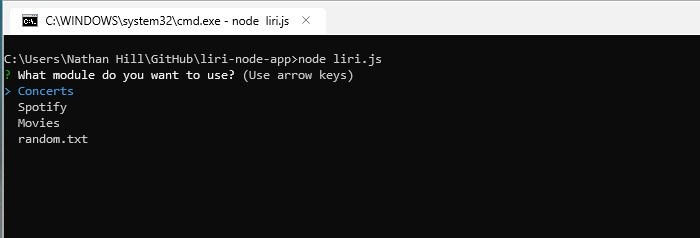
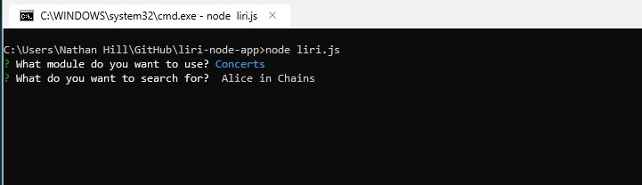
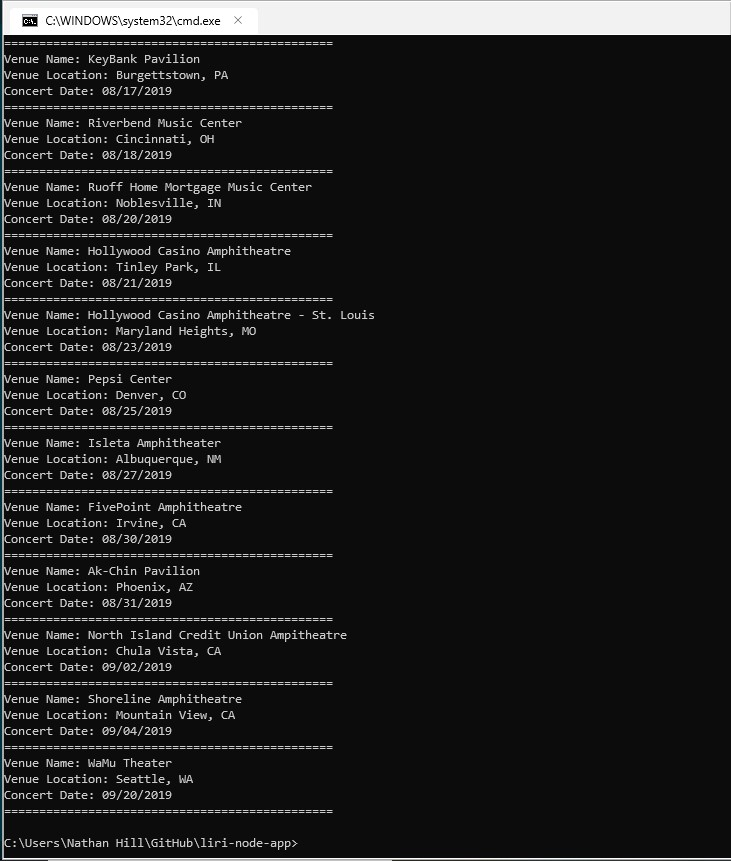
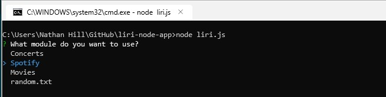
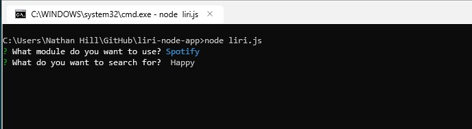
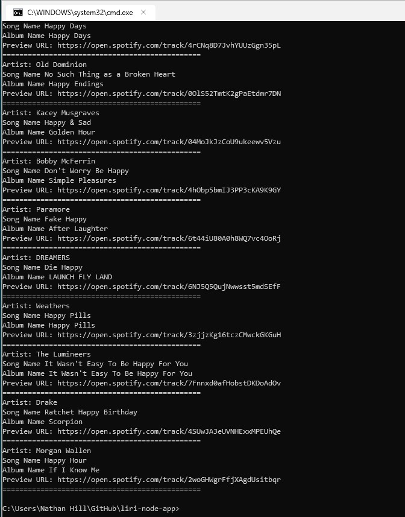
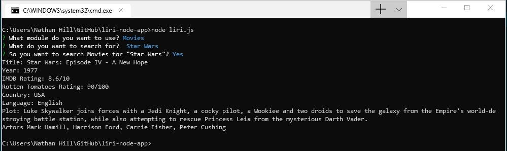

# liri-node-app
Welcome to my LIRI App, build in Node.js. This is a Language Interpretation Recognition Interface, built in a command-line environment. This is a text-only app, which hits one of three APIs based on input from the user: Spotify API, Bandsintown API, and the OMDB Api. To run this on your own, you will need to set up your own .env file like this:

    SPOTIFY_ID=*your-spotify-api-key-here*
    SPOTIFY_SECRET=*your-spotify-secret-key-here*

Once you set this file up you should be able to have access to all of the APIs used in this app. Now that we have set the stage, let's take a look at how to use my LIRI!

The initial version of liri took the commands as additional arguments on the command line, which worked but was not very user-friendly. One mis-spelled command and the app didn't work. Using the Inquirer package allows us to take the correct commands using a list, which saves a lot of that kind of headache. Here is a screenshot of our starting list: 

As you can see from this screenshot, we have four starting options: "Concerts", "Spotify", "Movies", and "random.txt". You can toggle between these choices by using the up and down arrows, and register your choice by pressing the <ENTER> key. I will come back to the random.txt in a bit, so for now let's start with the first option, "Concerts". When you press the <ENTER> key, you are asked for additional input. Here, you may enter a band or performer to search for. If no input is received, the API will automatically search for the Rolling Stones:

You will be asked to confirm your input by typing (Y/n). If you simply press <ENTER> at this input, the default is Yes. If you decide that your input is not what you wanted, pressing (n) will exit you from the program and you will be able to run it again to enter what you want. Once you confirm your input and press Y or <ENTER>, you will receive a list of the upcoming shows for that band from the BandsinTown API. 

The Spotify API functions similarly to the Concerts API. It will return a list of songs that match the search term, as shown below:

 
 
 

The movie search functions slightly differently, in that it will only return a single movie for each search. In the image below, you can see the full data input and response for the LIRI Movies search:

<h2>Random.txt</h2>

Random.txt is set up to not really be random, but to take input from the "random.txt" file. It takes two inputs, separated by commas, using the following criteria:

Input one must be the module you want to search for. Either "spotify", "concerts", or "movies". The second one must be your search term. The search term <b>cannot contain commas</b>, or it will  not work properly. The search term does not have to be wrapped in quotes, since the LIRI separates based on the commas, not spaces. The initial set of terms is:

    spotify,I Want it That Way

So play with the random.txt file, play around with the LIRI and have fun!

Nathan Hill